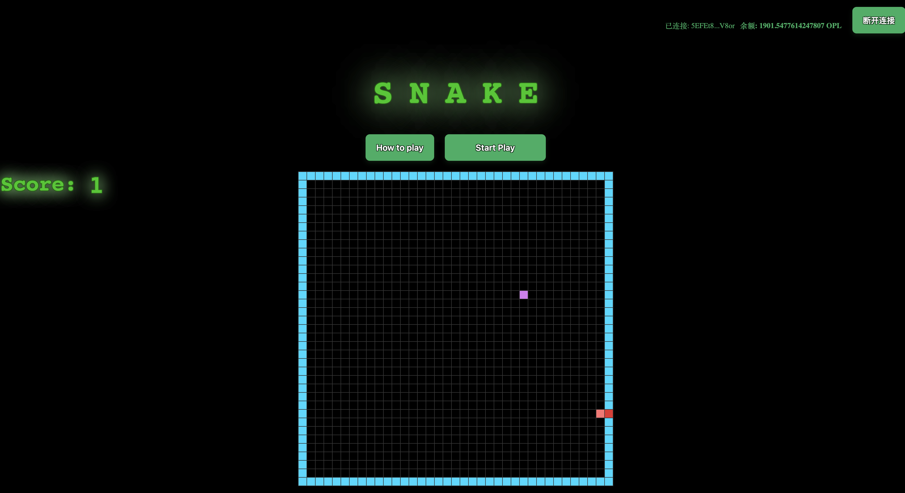
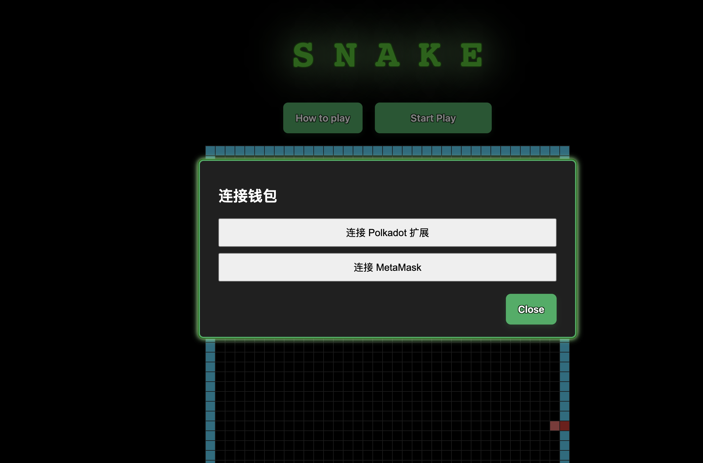
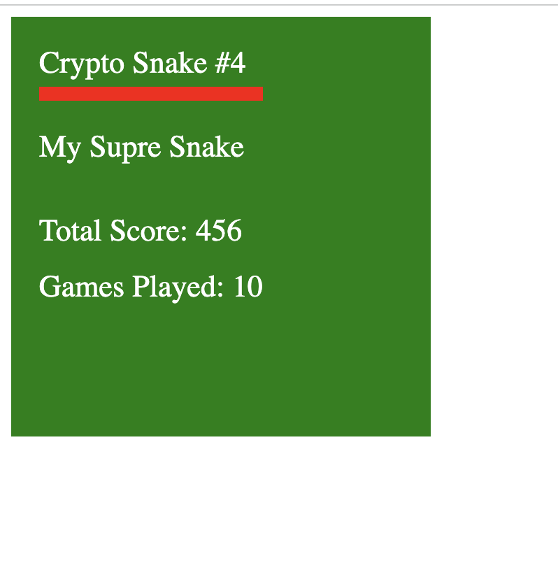

# Crypto Snake

## 参加的赛道： Unique Network

赛题要求是：

- 使用 Unique Network 的 SDK 与区块链进行交互
- 使用 Unique Network 的 native NFT 逻辑（即使用了 `CollectionMinter` 和 `TokenMinter`）
- 前端使用 Unique TS SDK 来于合约进行交互

## 项目说明

- 项目使用 Vue 3 和 TypeScript 开发。
- 项目使用 Unique Chain 的 SDK 与区块链进行交互。
- 玩家新建一个 Crypto Snake NFT 后，可以开始游戏。
- 游戏结束时，玩家 Crypto Snake NFT 的属性会更新。
- 玩家可以在 [Crypto Snake](https://crypto-snake.vercel.app/) 上玩游戏。
- 使用了 `CollectionMinter`
- 使用了 `TokenMinter`
- 属性更新后，NFT 对应的图片也会更新（nft 图片是在链上的）
  - 通过 `tokenURI` 读取链上数据动态拼出 nft 的属性 json，且其中图片为 svg：https://github.com/LuckyFT-com/unique-contracts/blob/main/contracts/recipes/CryptoSnake.sol#L104-L128

## 项目功能

- 连接钱包
- 断开钱包
- 获取账户信息
- 获取账户余额
- 获取账户资产
- 发送交易
- NFT 逻辑
  - 整个游戏是一个 NFT 的 collection： Crypto Snake
  - 每个 NFT 代表游戏中的 Crypto Snake
  - 每个 Crypto Snake 有几个属性值
    - nickname
    - totalScore
    - gamesPlayed

